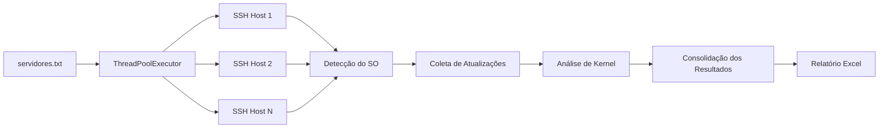

# Linux Patch Audit

## Visão Geral

<p>Script desenvolvido em Python para auditoria de atualizações pendentes em servidores Linux por meio de conexões SSH.
A solução permite identificar pacotes disponíveis para atualização, detectar atualizações de kernel, coletar informações do sistema operacional e gerar relatórios consolidados em Excel para apoiar atividades de gestão de patches, planejamento de manutenções e conformidade de infraestrutura.
Atualmente, a ferramenta oferece suporte aos sistemas Ubuntu, Debian, SUSE Linux Enterprise Server (SLES) e openSUSE.</p>

## Funcionalidades

* Conexão automatizada via SSH em múltiplos servidores
* Execução paralela utilizando múltiplas threads
* Identificação automática do sistema operacional
* Coleta de atualizações pendentes
* Identificação de atualizações relacionadas ao kernel
* Inventário da versão atual do kernel
* Identificação de novas versões de kernel disponíveis
* Geração de relatório consolidado em formato Excel
* Priorização de servidores com necessidade de atualização de kernel
* Suporte a ambientes Ubuntu, Debian, SUSE e openSUSE

## Casos de Uso

* Auditoria de gestão de patches
* Planejamento de janelas de manutenção
* Identificação de servidores que exigirão reinicialização
* Inventário de atualizações pendentes
* Revisões de conformidade e segurança
* Avaliação de exposição a vulnerabilidades
* Governança de infraestrutura Linux

## Arquitetura

O fluxo de execução é composto pelas seguintes etapas:

1. Leitura da lista de servidores
2. Estabelecimento da conexão SSH
3. Identificação do sistema operacional
4. Coleta de atualizações disponíveis
5. Análise de atualizações de kernel
6. Consolidação dos resultados
7. Geração do relatório Excel




## Configuração

Crie um arquivo `.env` na raiz do projeto:

```env
SSH_USER_1=usuario1
SSH_PASS_1=senha1

SSH_USER_2=usuario2
SSH_PASS_2=senha2
```

A ferramenta tentará autenticar em cada servidor utilizando as credenciais configuradas, na ordem definida.

**NUNCA versione o arquivo `.env`.**

## Requisitos

### Versão do Python
* Python 3.9 ou superior

## Dependências

Instale as dependências necessárias:

```bash 
pip install -r requirements.txt
```

Arquivo <strong> requirements.txt </strong>:

```text
paramiko 
openpyxl
```

## Estrutura do Projeto

```bash 
linux-patch-audit/ 
├── patch_audit.py 
├── .env
├── servidores.txt 
├── requirements.txt 
├── README.md 
└── relatorio_updates.xlsx
```

## Inventário de Servidores

Crie um arquivo chamado <strong> servidores.txt </strong> contendo um servidor por linha:

```text 
srv-linux-01 
srv-linux-02 
10.10.10.50
```
Comentários são suportados:

```text 
# Ambiente de Homologação 
srv-linux-01

# Ambiente de Produção 
srv-linux-02
```

## Execução

Execute o script:

```bash 
python3 patch_audit.py
```

Exemplo de saída:

```bash
Total de servidores: 50 
Executando com 10 threads... 

Iniciando: srv-linux-01 
Iniciando: srv-linux-02 

Finalizado: srv-linux-01 | IP: 10.10.10.10 -> OK 
Finalizado: srv-linux-02 | IP: 10.10.10.11 -> OK 

Relatório gerado: relatorio_updates.xlsx
```

## Informações Coletadas

O relatório gerado contém as seguintes informações:

| Campo                      | Descrição                                          |
|----------------------------|----------------------------------------------------|
| Servidor                   | Nome do host                                       |
| Endereço IP                | IP principal do servidor                           |
| Sistema Operacional        | Sistema operacional identificado                   |
| Usuário                    | Usuário utilizado na conexão SSH                   |
| Quantidade de Atualizações | Total de pacotes disponíveis para atualização      |
| Lista de Pacotes           | Relação dos pacotes atualizáveis                   |
| Atualização de Kernel      | Indica se existe atualização de kernel disponível  |
| Kernel Atual               | Versão atualmente em execução                      |
| Nova Versão do Kernel      | Versão disponível para atualização                 |
| Pacotes de Kernel          | Pacotes relacionados ao kernel identificados       |
| Data da Coleta             | Data e horário da execução                         |


## Sistemas Operacionais Suportados

### Ubuntu / Debian

As atualizações são obtidas através do comando:

```bash 
apt list --upgradable
```

### SUSE / openSUSE

As atualizações são obtidas através do comando:

```bash 
zypper list-updates
```

## Priorização dos Resultados

Os servidores são ordenados automaticamente de acordo com os seguintes critérios:

1. Servidores com atualização de kernel pendente
2. Maior quantidade de atualizações disponíveis
3. Ordem alfabética do hostname

*Essa classificação facilita a identificação dos sistemas que demandam maior atenção durante o planejamento das manutenções.*


## Limitações

* Requer conectividade SSH com os servidores de destino
* Depende da disponibilidade dos repositórios de pacotes
* Algumas consultas podem exigir privilégios elevados
* O tempo de execução pode variar conforme a latência da rede e quantidade de servidores

## Licença

Este projeto está licenciado sob os termos da licença MIT.


